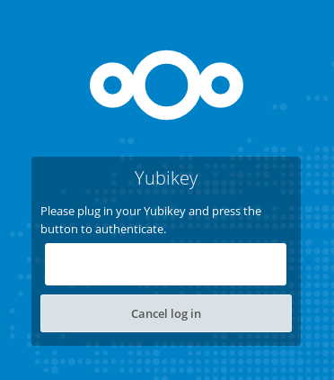

# Two Factor provider for Yubikey OTP

This is a second factor authentication provider for Yubico Yubikey devices in the original OTP (one time password) configuration.

 # System Configuration
 You need to configure Nextcloud to use an authentication server. This is done in the security tab in the administration settings page.
 To authenticate via the standard Yubico cloud servers you will need to create a client ID and API key.
 This is free and can be generated at https://upgrade.yubico.com/getapikey/https://upgrade.yubico.com/getapikey/

 If you have your own authentication server you can fill in the details.

 # User Configuration
In the user's security settings tab, the IDs of the user's Yubikey(s) need to be registered. Select the 'Add new Yubikey' box and then press the activation button on the Yubikey. The OTP code on the key will be checked to ensure that the user can authenticate.
 
If a user has one or more Yubikeys registered to them then they will need to use the Yubikey (or any other configured second factor) to log in.

As with any second factor provider, apps that automatically authenticate (for example your Android app or your GNOME app) will need to login using device passwords. To manage it, [know more here](https://docs.nextcloud.com/server/11/user_manual/session_management.html#managing-devices)
